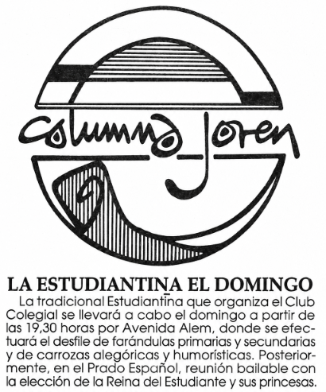
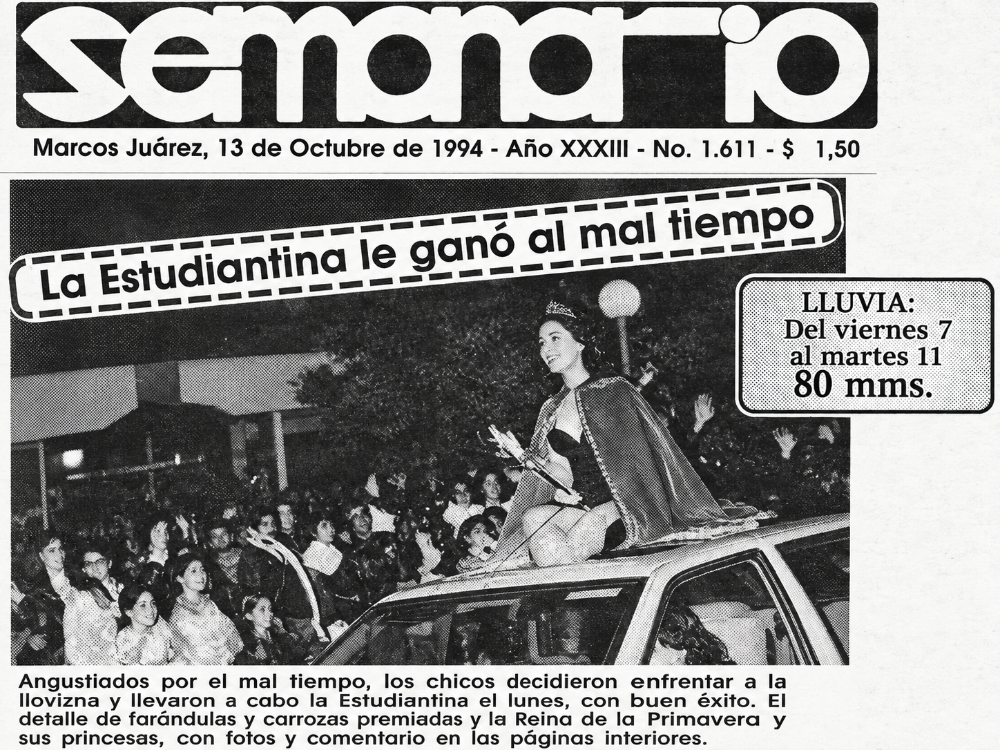
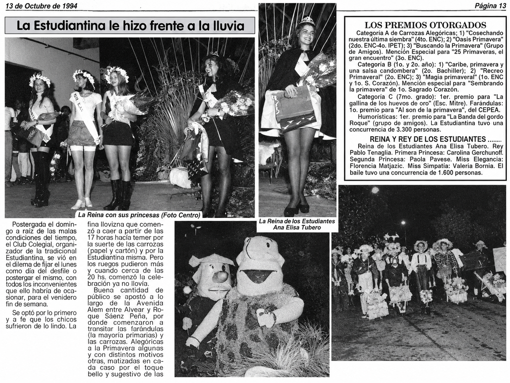

*[Si querés saltearte la perorata e ir directo a los videítos, están al final!.](#estudiantina-1994)*

1994 era nuestro último año de secundaria, quinto año en la Escuela Nacional de Comercio. Y buena parte de ese último año giró alrededor de la Estudiantina.

La Estudiantina de Marcos Juárez venía de una [tradición iniciada en 1948](https://ensbelgrano-cba.infd.edu.ar/sitio/historia/) y para 1994 llegaba a su 47.ª edición.

Durante toda la secundaria participamos en hacer carrozas, algunos más y otros menos. Aunque todas las escuelas podían participar del desfile, la organización quedaba en manos de los alumnos de quinto de Comercio y del Bachiller, con ayuda de padres y profesores.

Para entonces la Estudiantina incluía bastante más que el desfile. Durante el año organizábamos algunos bailes para juntar fondos, ese año hasta hicimos una bicicleteada, y todo cerraba con el desfile y el baile de la Estudiantina.

Lo tomábamos todo lo en serio que se podía tomar algo a esa edad, porque ese trabajo dejaba algo de plata para el viaje de egresados.

Durante el desfile, delante de las carrozas iban las candidatas a reina, muchas veces sentadas sobre el capot de un auto, haciendo aquel lento "saludo de reina" con la mano de lado a lado. La elección llegaba después, durante el baile.

Los que la vivieron seguramente se acuerdan de que el desfile empezaba varios meses antes de la noche del desfile. Se veían bicicletas y motos llevando materiales para "el galpón" de la carroza. Se hacía como se podía, pidiendo, tomando prestado y, cada tanto, tomando prestado y no devolviendo.

No sé cuántas carrozas habrán sido hechas de "corralitos" (no los de Cavallo, esos vinieron después). Recordarán —y si no, les cuento— esas estructuras metálicas que la gente ponía sobre las veredas para marcar el pozo ciego. Durante unos años caminar por algunas veredas de Marcos Juárez tenía cierto componente de deporte extremo. Éramos la capital del pozo ciego con banda sonora de los Cadillacs 😜. Llegaba la noche y podía escucharse el ruido metálico de alguno siendo arrastrado por el pavimento por alguna motito.

Las carrozas alegóricas solían empezar con una estructura de hierro soldada —cuántos ojos habrán terminado "flechados" ahí— recubierta con bolsas arpilleras de plástico. Después venían cientos de flores hechas con papel de diario, atadas con alambre y "finamente" pintadas con pintura sintética rebajada con nafta para que rindiera más y no tapara el soplete. Todavía no entiendo cómo sobrevivimos, jua!. Sobre todo los que después se metían dentro de los monigotes para crear la magia del movimiento.

En 1994 el desfile estaba previsto para el domingo 9 de octubre, pero el mal tiempo obligó a pasarlo al lunes 10. Las puteadas que recibimos fueron unas cuantas, para peor, el lunes volvió a lloviznar durante la tarde, pero cerca de las ocho paró y finalmente arrancó el desfile por avenida Alem.

Hay bastante historia escrita sobre la Estudiantina y no tiene mucho sentido repetirla completa acá. Toda esta introducción era para acompañar estos videítos.

Algunas imágenes son de TRU y otras las grabamos nosotros con una cámara Panasonic de la escuela, una de esas enormes que se apoyaban en el hombro y grababan directamente en VHS. No recuerdo para qué taller había llegado aquella cámara, pero sí recuerdo que después de un rato se hacía sentir.

Hace tiempo recuperé esas cintas. Pasaron del VHS a digital, después por DivX, MPG y algún formato más que seguramente estoy olvidando, hasta terminar en YouTube. Y por suerte quedaron ahí.

Aprovechen la magia de la nostalgia.

## Estudiantina 1994



## Concurso de tortas

Esto no era parte de la Estudiantina. Era otra tradición de la Escuela de Comercio en la que participaba toda la escuela y que organizábamos los de quinto año.



## Y de yapa, un acto


